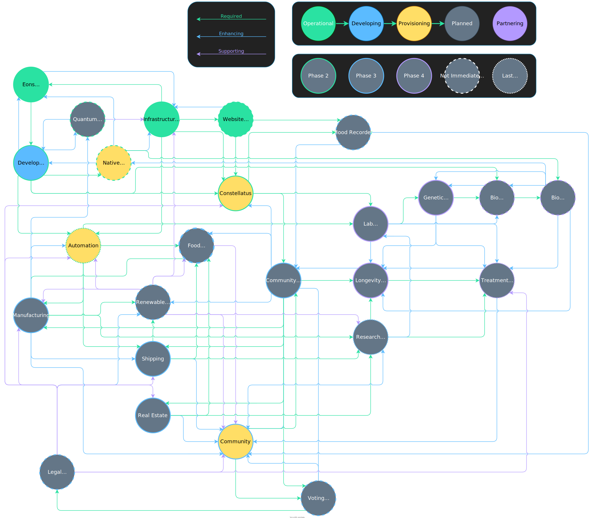

# Eons

## History

The following plan was developed by Séon in his youth. Despite his ignorance, the trajectory described has deviated very little from our goals today. While not all members of Eons LLC fully agree with what is said here, the goals of the company currently align with this trajectory. Ultimately, what we're trying to do is benefit humanity and we can all get behind that.

## Preface
In light of the current inability to prove or disprove the existence of an omnipotent being as well as the fleeting nature of our own existence, a dichotomy of choice is constructed from the conflict between enjoyment and knowledge. One may spend their life consuming resource in the search of enjoyment or they may sacrifice their own enjoyment for the prolonging of the existence of themselves and their children. Ultimately, it is the job of intelligent systems, like humans, to take energy from the environment and convert chaos into order. This document will layout a path to maximize this conversion in the hopes that our roles in the universe are greater than just this job. This path will not be easy, and it will certainly not be the most enjoyable, but it is better than death.
Note that Phases and Stages do not have to proceed directly in the order they are described. Stages will often proceed in order, but Phases should overlap significantly.

## Phase 1: The Beginning

### Reason
Setup and preparation for executing the remainder of this plan.

### Details
This Phase focuses on gathering the necessary resources to start this plan. The completion of each subsequent phase should produce world-changing effects. 

### Stages

#### Stage 1: Conception of the plan.
Answers the question: what should I do with my life?

#### Stage 2: Reception of the plan
Will others help me to accomplish this?

#### Stage 3: Completion of initial education
Figure out, broadly, what is needed to make this happen.

#### Stage 4: Further education
Gather more in-depth knowledge about how to solve the problems faced throughout this journey.

## Phase 2: Computational Life

### Reason
Cheap and fast skilled labor as well as increased automation for nearly all tasks.

### Details
Until recently, human intelligence, as well as any biological intelligence, has been revered as almost magical in its ability to generate complex outputs to complex stimuli. With the rise in artificial intelligence, it is likely that human-built computers will soon surpass many biological systems in their ability to learn. However, there is still a lot of work to be done before computers can compete with biological systems.
This phase focuses on addressing the key problems facing current artificial intelligence and will produce a framework for automating nearly any task.

### Stages

#### Stage 1: Define Intelligence
There is a lot of thought that must be put into divining a thought process. Especially because the thoughts that humans experience are not unique, simply complex. Primary neuroscience research can help in illuminating the logic behind various thought patterns.

#### Stage 2: Intelligent Systems as a Whole
There are many pieces that go into intelligence beyond just the ability to learn. Firstly, learning must occur to a set of inputs and must dictate a set of outputs; therefore, the intelligence of a system is dictated by its abilities. Secondly, there are internal factors (like emotions) that contribute to the decision-making process that cannot be overlooked.

#### Stage 3: Automation Platform
Using the definition of intelligence and the effects of other system-related factors, a framework may be built for replicating logical decisions that would otherwise require a biological system to make.
This platform will be leveraged in all subsequent phases.

#### Stage 4: Beyond Human
If done right, the platform built in Stage 3 should be scalable such that it exceeds the intelligence capacity of any existing biological system.
This stage involves integrating multiple intelligent machines into a single consciousness, if you will. This will allow inputs from multiple machines to be integrated into a single decision-making process.
A super-intelligent being of this kind would drastically aid in any pursuit. If this point is reached, a being like this should be able to carry out this plan in the absence of any biological intelligence. Thus, it will be a fallback plan in case humanity is somehow ended.

## Phase 3: Research Facilities

### Reason
Reduction in societal barriers to scientific progress.

### Details
The amount that modern society values science is too low. The funding for science is dismal, especially in America. While the regulations for implementing scientific discoveries are understandably very tight, the cost of regulating new technologies provides a very large hurdle for prospective researchers. If given the opportunity, many of the world’s every day processes could be improved, many to the point of complete automation. 
This phase focuses on creating a community that is not heavily tied to the regulations of the world where technological advances can be implemented at a much faster rate than current countries would allow for. Using the automation technology developed in Phase 2, a modern community can be built where manual labor is minimized in favor of intellectual pursuits. This will aid all future research, helping to see this plan to fruition. 

#### Economy
A community, as proposed, should be entirely self-sustaining. Ideally energy would be provided from a direct enthalpy to electricity conversion, but that does not seem to exist yet. It may be necessary to import physical resources, such as metals, soils, or potentially nuclear fuels.
A community like this would require completely automated farming procedures to produce whatever foods or fuels would be needed. The upkeep and maintenance of all buildings and operations should also be automated along with as many of the community functions as possible. Ideally, work would be unnecessary for intelligent systems. 
Given the ability to sustain a limited population on relatively passive income, a communal economy may be created that gives increased resources to those who create profitable technologies or provide services that increase the development of the community. By directly tying technological progress to the economy, focus can be placed on the betterment of all members of the community. 
Reproduction or otherwise expanding the community may cost the wanting group a fee proportional to the increase in passive income it would take to sustain the new expansion. Additionally, less productive members of the society may need to be removed in favor of higher functioning members, should resources become scarcer or time become more critical.

#### Regulations
It should hopefully go without saying that there is a need to have technology regulated before it is implemented in society. An economy focused on technological progress must take safety into account. By making safety part of the currency, good science and quality implementation should be encouraged. If using a distributed ledger, tokens may account for the quality of inventions, including their safety.

### Stages

#### Stage 1: Manufacturing
Regardless of location, no technological society may function without the means of implementing its discoveries. The hardest part in realizing such a society will be the acquisition of resource and its subsequent application.
Ideally, the location of such a society would be as little reliant on Earth as possible. For instance, buildings may be manufactured such that they could exist in the ocean or in space and could freely associate with other buildings so as to allow for expansion and rearrangement of any developments.
Given the need for imported resource, a society like this, regardless of location, should account for either trade arrangements or ownership of Earthly resources. Eventually a matter converter should be constructed that can re-arrange the atomic structure of any given particle, which would completely remove any dependence on mining, etc. However, it seems unlikely that such a device will be created and be efficient enough to warrant use by the time this stage is underway.

#### Stage 2: Energy
The energy needs for a society like this will likely have to draw from solar power until nuclear power becomes economical. Given the negative effects of carbon emission, it would likely be a poor choice to attempt its utilization. The most effective solar cell may end up being a biological ecosystem, such as algae that is converted into biofuel, the waste of which would be provided back to the algae to reproduce. Regardless of whether biological or photovoltaic technology is most efficient, some form of capturing solar energy should be the first step in solving the energy problem.
Other forms of energy, such as wind, ocean currents, geothermal, etc. may also be good first, second, third, etc. choices.

#### Stage 3: Population
Once manufacturing and energy production have been addressed, the necessary infrastructure to support a community should be in place. The next steps are then to build food production, living spaces, research and other work areas, etc.
This stage also addresses the resources required to sustain biological life that have not been taken into account in the previous stages. Besides food, this also includes necessary nutrients, and, primarily, clean water. Desalination seems to be the most effective solution to this problem, but other options may present themselves based on the location chosen for the community. The nutrients (e.g. soil) required for growing food may need to be imported along with manufacturing resources.

#### Stage 4: Beyond Sustainable
Once all needs of the community have been addressed, it may expand, so long as it does not become unsustainable. If this point is reached, the community developed should be able to solve many, if not all, of the problems facing it and will continue to survive even if those that begun this journey are lost.

## Phase 4: Solving of Biology

### Reason
Advanced chemical systems will likely be more efficient than the computation systems of today.

### Details
This phase is the main focus of this plan and involves the culmination of all work done previously. What is meant by “solving” biology is obtaining a complete understanding of its workings and an ability to manipulate it to the furthest extent possible. In doing so, the following should be accomplished:
Achieve immortality. This may be as humans or any other organism.
Create framework for implementing biological modifications at run time.
Create a means of converting existing cells into those that support the created framework.
Create an interface between thought processes and biological modifications.
Because more advanced technical resources should be available, many more problems than just the solving of biology may be addressed. For instance, climate change, food shortages, diseases, etc. may all be worked on as part of this stage.

### Stages

#### Stage 1: Senescence
Why and how we age, along with age-related diseases, should be the first pursuit in this phase. This will provide a much better chance for seeing this plan through and not dying before it is complete.
The actual implementation of any senescence-fighting therapies may have to wait until a later stage, where cells can be manipulated more readily.

#### Stage 2: The Perfect Cell
The ultimate result of studying biological systems will be the creation of a new cell that can embody whatever functionality is desired while still retaining its ability to change itself and resist change from the environment. While this may be an oversimplification of the process (i.e. smaller, disposable cells may be more efficient than a single omnipotent one), the point is that the chemical interactions within a complex, biological environment may be manipulated to endow a cell with whatever functionality is desired.

#### Stage 3: The Perfect Organism
Once the perfect cell has been devised, the next step is to combine them in a way that they may interact with each other to accomplish goals. This requires building in a communication system between cells that would allow them to engage in new functions for any given purpose (e.g. maybe tentacles are more desired than fingers, so the cells change to form the most ideal arrangement). A communication platform like this, may be similar to Séon’s biological blockchain idea.

#### Stage 4: The Conversion
Assuming that there are humans still alive at this point, a means of converting existing biological systems into ideal ones should be devised and implemented. This will allow maximum utilization of all available resources.
If there is resistance to this idea from existing organisms, I would hope that they be allowed to die in peace, on their own.

## Phase 5: Eternity

### Reason
To know all.

### Details
However, if it is, there are many challenges that must be addressed in order to gather as much information about the universe as possible. These problems assume that there is no source of infinite energy discovered and that the most efficient energy production is the consumption of matter via nuclear fusion.
The first of such problems involves the expiration of Earth. The resources on the home planet must be exploited to the fullest extent in order to provide as high a probability of success as possible. The consumption of these resources should focus on harvesting as much solar energy as possible, and, later, the consumption of as many nearby celestial bodies as is profitable. This process will continue until a source of infinite energy is discovered or humanity (in whatever form it has become) dies.
The second is a less technical problem and a more ethical one. Humanity, in its current form, is too inefficient to survive. Given the vast technological advances required to reach this point, it is unlikely that a single entity would be less beneficial than a collection of less capable ones. Meaning to say that human bodies may be forfeited in favor of a hive-mind like intelligent system, similar to that developed in Phase 2 Stage 4, but utilizing more advanced chemical technology.
Beyond these two major hurdles, it would be very surprising if there were not additional issues faced at this stage.
